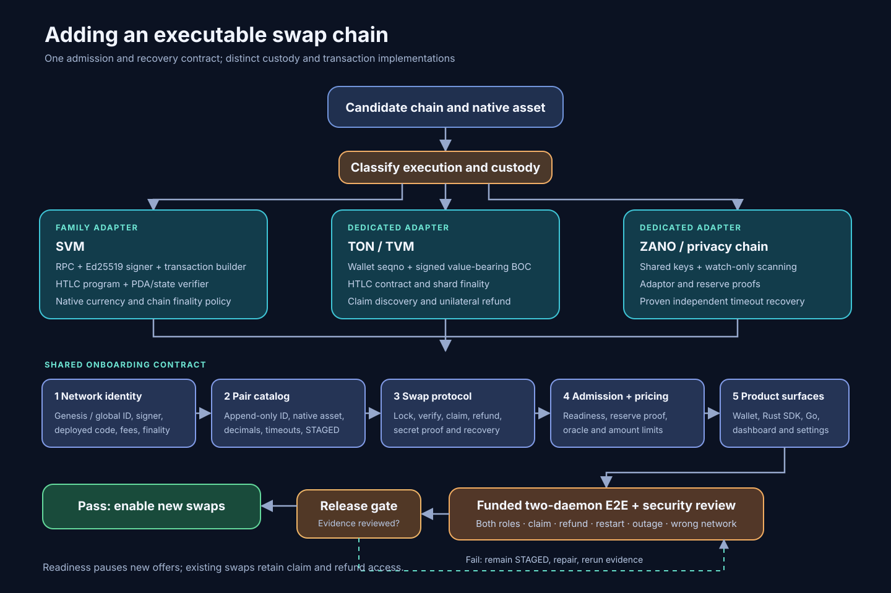

# SVM swap adapter kit and chain onboarding

**Planning snapshot:** 2026-10-04. **Scope:** executable, funded XFG/native-asset swaps. The first SVM target is not yet selected. Estimates assume one Solana-compatible RPC and runtime, native system-account currency, and the existing HTLC/BRIDGE protocol. SPL tokens and pure PTLC are separate work.

The editable diagram is [swap-chain-onboarding.mmd](swap-chain-onboarding.mmd).

## Effort

| Work | One engineer's effort | Exit condition |
| --- | ---: | --- |
| Make the existing SOL path safe and testable | 3–5 weeks | Network, program, lock, finality, and recovery checks pass on a funded testnet |
| Extract the SVM family kit and catalog-keyed config | 4–6 weeks | SOL still works; a second SVM uses the same client without another copied chain class |
| Deploy and onboard the first additional native-asset SVM | 3–5 weeks | Both swap roles complete on that chain and on Fuego testnet |
| Recovery, adversarial tests, wallet/CLI/SDK wiring, release review | 3–5 weeks | Claim and refund remain safe through restart, RPC failure, and delayed finality |
| **First additional SVM total** | **13–21 weeks** | Includes funded E2E; workstreams can overlap with two engineers |
| Each further compatible native-asset SVM | 2–4 weeks | Its own deployment, identity, asset feed, and funded E2E evidence |

Add **4–8 weeks per family** if the chain requires SPL token settlement, different transaction semantics, or a new HTLC program. Pure PTLC is a separate protocol and contract review. Independent security review and any network-dependent funding or deployment wait are outside the engineering ranges. A catalog row and a responding RPC do not establish swap support.

TON and ZANO are separate projects. The SVM kit contributes the common admission and recovery gates, not their custody mechanisms. Working estimates from the current code are **8–14 weeks for TON** and **10–18 weeks for ZANO**, each including funded testnet recovery. Those ranges need re-estimation after contract and cryptographic design review.

## Current state and hard blockers

- `fuego-suite/src/SwapDaemon/SwapPairCatalog.h` has 46 append-only pair IDs. `SOL=0` is the only `SOLANA` family row. New IDs must be appended; old records must keep their meaning. `SIA`, `ZANO`, `TON`, and `DOT` are `STAGED` and rejected for new swaps.
- EVM already has `evm_chains.<catalog-key>`, per-chain RPC identity, signer, contract address, and `EthChainClient::readinessError()`. SOL still uses flat `sol_*` fields and one hard-wired registration in `SwapDaemon.cpp`. `SolChainClient` inherits the default ready result, which only checks a height through `SwapDaemon::getChainReadiness()`.
- `SolRpcClient` uses raw HTTP sockets with no TLS, no HTTP status validation, and a single `send()` call. It has no `getGenesisHash` check. It treats `confirmed` as send success while some later reads require `finalized`. The kit needs a defined finality and uncertain-broadcast policy before public RPC use.
- `SolRpcClient::parseHtlcState()` returns sender and recipient as hex; `SolChainClient::verifyLock()` compares the recipient to the swap's base58 address. Fix the encoding mismatch and bind every accepted lock to the expected sender, recipient, amount, hash or point, timeout, PDA seeds, owner, program version, and network.
- The committed `xfg_htlc` program uses a local deployment ID. Its own source says older 155-byte accounts cannot be read by the newer 188-byte program. Upgrades with open swaps need a versioned recovery path or must wait until those swaps settle. Its `lock()` moves native lamports; it does not escrow SPL assets.
- `SolChainClient::supportsPtlc()` is false despite `lockPtlc()` code. Ship SVM onboarding through the established HTLC/BRIDGE path first; claim no pure PTLC support until the entire negotiation and funded recovery path is verified.
- The existing `test_sol_e2e` drives one SOL lock/claim/extract on a local validator. It is not a two-daemon XFG↔SOL funded testnet run and does not exercise refunds or restart recovery.

## Target architecture

1. **Identity and catalog.** Keep pair ID distinct from network identity. An SVM uses a base58 genesis hash from `getGenesisHash`, not an EVM numeric chain ID. Add an `SVM` family or a compatible extension of `SOLANA`, keeping serialized pair IDs stable. Each row fixes native asset, atomic decimals, block-time bounds, and `STAGED`/`ADAPTER`/`ACTIVE` status. The first target must publish its actual testnet genesis and native-asset rules before a row is promoted.
2. **Operator config.** Add `svm_chains.<catalog-key>` with explicit RPC URL, expected genesis hash, signer key-file reference, deployed program ID, program version or digest, commitment policy, fee/rent ceilings, and finality settings. Reject unknown fields, duplicate pair entries, wrong family, empty identity, wrong network, and unsupported program ABI. Keep keys out of config exports and logs. Preserve legacy `sol_*` parsing for old deployments and existing swaps, with explicit precedence and migration tests.
3. **Shared transport and signer.** Replace the current Solana socket transport with bounded HTTPS JSON-RPC, typed responses, deadlines, response-size limits, and explicit RPC error handling. Share Ed25519 signing, compact transaction encoding, recent-blockhash handling, fee estimation, submission, and signature tracking. Persist transaction signatures separately from HTLC PDA references. On timeout or lost RPC response, query chain state before retrying; never assume a secret-bearing claim was not broadcast.
4. **Shared `SvmChainClient`.** Inject pair identity and a checked network profile instead of returning `"SOL"` or assuming one program. Implement `IChainClient` lock, verify, claim, refund, reserve proof, current slot, transaction details, and claimed-secret extraction. Require finalized chain evidence before releasing XFG. A failed new-swap preflight must still leave claim/refund available for existing swaps.
5. **Program deployment.** Build and audit the real `xfg_htlc` program for each compatible network. Record the deployed program ID, executable account, upgrade authority or immutable status, code/ABI version, PDA rules, and migration policy. An SVM implementation can reuse this program only after verifying system-account lamports, CPI behavior, account layout, and finality on that chain. A program upgrade or digest mismatch pauses new swaps without discarding recovery.
6. **Swap economics and surfaces.** Use the chain's native asset and decimals in `SwapPairCatalog`, amount conversion, minimums, price feeds, fees, and reserve proofs. A quote for FOGO, for example, cannot use SOL pricing. Update the orderbook executable-pair gate, daemon catalog/readiness RPC, wallet `SwapPairSdk` and chain metadata, Rust SDK wire IDs, Go TUI/dashboard, icons, explorers, and settings. Remove silent unknown-pair fallback in wallet consumers before exposing a new ID.

The [Solana `getGenesisHash` RPC](https://solana.com/docs/rpc/http/getgenesishash) provides the identity check. [Fogo's official testnet documentation](https://docs.fogo.io/testnet.html) is a useful first compatibility probe: it publishes genesis `9GGSFo95raqzZxWqKM5tGYvJp5iv4Dm565S4r8h5PEu9` and targets 40 ms blocks, far from SOL's cataloged 400 ms. [Fogo documents Solana tooling and native FOGO](https://docs.fogo.io/user-guides/using-solana-tools.html). Selecting Fogo would still require a deployed and audited HTLC program and funded evidence; its documentation alone does not prove compatibility.

## Delivery sequence and gates

| Phase | Deliverable | Must pass before the next phase |
| --- | --- | --- |
| 0. SOL baseline | Fix encoding, identity, transport, program-version, finality, retry, and signer handling. Record old-swap recovery behavior. | Existing SOL swaps and account layouts remain recoverable; invalid locks fail closed. |
| 1. SVM family | Catalog-keyed config and shared transport/client; migrate SOL onto it with backward config support. | Same SOL funded path works through old and new config; wrong genesis/program/signer cannot start a swap. |
| 2. First network | Verify native currency and decimals, deploy program, add catalog and oracle metadata, then register the adapter. | Program ABI and PDA proofs match; fee/rent and timeout runway fit observed finality. |
| 3. Product wiring | Update daemon admission, wallet, Rust, Go, dashboard, and reserve-proof challenge binding. | Every surfaced pair resolves to the same ID, asset, network, and readiness state. |
| 4. Release evidence | Two `xfg-swapd` instances plus Fuego testnet: both roles, funded lock→claim and timeout→refund, restart and RPC-loss recovery, wrong-chain/program rejection, replay/duplicate submission, delayed finality, and fee exhaustion. | Independent review of the program and state-machine changes; only then change the pair from `STAGED` to executable. |

Keep a per-network evidence record containing the source revision, deployed program ID and digest, genesis hash, transaction/account references, both daemon logs with secrets removed, claim and refund outcomes, and known exclusions. A local validator test, build, or readiness check is supporting evidence, not the funded E2E gate.

## When the chain is TON or ZANO

Both use the catalog, network identity, signer custody, pricing, readiness, reserve proof, offer admission, recovery, and funded E2E gates above. Neither can be instantiated as an SVM profile.

| Chain | Additional work required by its protocol | Current blocker visible in source |
| --- | --- | --- |
| TON | Validate `global_id`, wallet contract and seqno; construct and sign value-bearing internal messages and BOCs; verify the HTLC code/state, recipient, hash, amount, timeout, fees, shard finality, claim discovery, and unilateral refund. | `TonRpcClient::lockHtlc()` ignores `walletKeyHex` and `amountNano`, and can accept an already-funded contract after `sendBoc` fails. `TonChainClient::verifyReserveProof()` is unimplemented. The pair remains staged. |
| ZANO | Bind testnet identity and address prefix; review shared-key/adaptor equations and watch-only scanning; prove each party's spend and unilateral timeout refund under abandonment; verify unlock depth, reserve proof, reorg handling, signer isolation, and recovery without the peer. | `ZanoRpcClient::claimAdaptor()` and `refundAdaptor()` both combine the same two spend shares. The code shown does not establish an independent timeout refund path. The pair remains staged. |

`fuego-suite/src/SwapDaemon/SwapOfferRelay.h` still excludes both from executable offers. Removing that gate is the last protocol step, after the funded evidence, rather than the first implementation step.

## Source anchors

`fuego-suite/src/SwapDaemon/SwapPairCatalog.h`; `SwapDaemon.h`; `ChainClientConfig.cpp`; `SwapDaemon.cpp`; `IChainClient.h`; `ChainClientResult.h`; `Solana/SolChainClient.cpp`; `Solana/SolRpcClient.cpp`; `Solana/htlc_program.rs`; `Solana/program/README.md`; `Ton/TonRpcClient.cpp`; `Ton/TonChainClient.cpp`; `Zano/ZanoRpcClient.cpp`; `Zano/ZanoChainClient.cpp`; `src/CryptoNoteCore/SwapOfferRelay.h`; `lib/models/swap_models.dart`; `rust-fuego-wallet/fuego-sdk/fuego-sdk/src/types.rs`.
